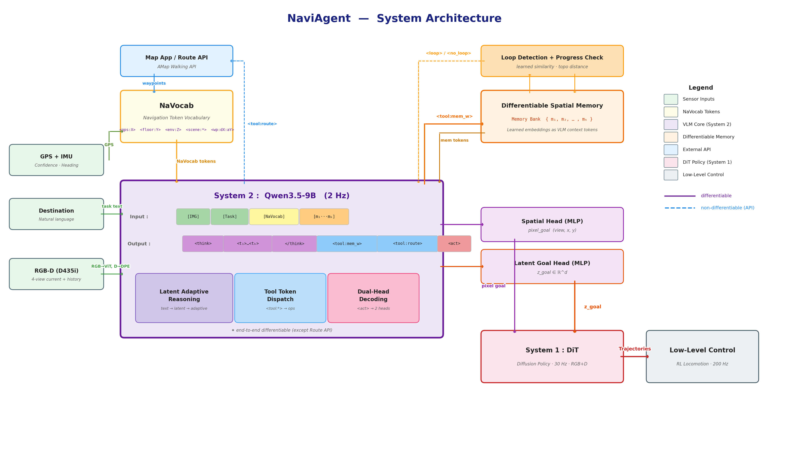

# NaviAgent: Cross-Environment Navigation via Differentiable Tool Tokens and Spatial Memory

---

## 1. Motivation

### 1.1 人类是怎么导航的？

给一个人任务"去星巴克买一杯咖啡"，他的大脑会这样运转：

1. **理解任务**：目的地是星巴克→掏出手机→打开高德地图搜索→找到最近的在南边500米外的商场3楼
2. **感知环境**：看看周围——我在办公室，通过窗户看出是在高楼层→判断大概在二楼
3. **制定计划**：需要先下楼→出建筑→跟导航走→进目标商场→上3楼→找星巴克
4. **设定短目标**：当前第一步——找楼梯或电梯下楼
5. **执行**：看到走廊尽头有电梯标志→朝那个方向走
6. **检查进度**：走了一会儿，感觉不对→回想一下刚才的路→发现走重复了→换个方向
7. **到达楼梯**：下楼→确认到了一楼→找到大门出去
8. **切换模式**：到了室外→掏出手机看导航→跟着路线走
9. **持续监控**：走了200米→看一眼手机确认方向对不对→继续走
10. **到达目标建筑**：收起手机→进入商场→找电梯上3楼→靠视觉找星巴克

人类的导航本质上是一个**使用工具的认知Agent**：

- **主动调用工具**：需要的时候掏手机看导航，不需要的时候靠眼睛
- **实时建立心理地图**：记住走过的路、看到的标志物——**这个记忆不是一张纸质地图，而是大脑神经网络中的隐式表征**
- **自我监控与纠错**：发现走错了会查看心理地图、重新规划
- **分层决策**：高层规划（从A到B的路线）+ 低层执行（避开眼前的障碍物）
- **自适应推理深度**：简单直行时不需要深度思考，复杂路口需要仔细判断

### 1.2 现有方法的缺陷

#### 缺陷一：被动的条件反射，没有主动探索能力

现有VLN模型本质上是**指令跟随系统**——它们需要详细的路线描述文本（如R2R数据集中的"Walk past the table and turn left at the hallway"）才能导航。一旦没有这种turn-by-turn的语义导览，它们便无法自主行动。

- **DualVLN** (2025) / **InternVLA-N1** (2025)：输入图像+指令文本→输出pixel goal。模型的决策完全依赖指令文本中对路线的描述——"经过桌子后左转"告诉模型在哪里转弯。如果把指令换成"去3楼的星巴克"这种目标导向的描述（没有具体路线信息），模型便不知道该往哪走，因为它从未学过**自主探索**。
- **BridgeNav** (Zhao et al., 2026) 明确指出了这个问题：现有benchmark（R2R-CE、GOAT-Bench等）都假设有详细的路线引导（R2R-style instructions），本质上是"有图导航"——指令文本就是一种隐式的地图。而真实场景中（如"去最近的便利店"），agent需要自己探索环境、寻找目标，没有任何路线先验。
- **ObjectNav** 系列（HM3D上的方法如CogNav、ASCENT等）虽然是探索式的，但仅限室内单建筑短距离（5-20m），不涉及跨环境长程任务。

#### 缺陷二：单一环境，无法处理跨环境过渡

所有现有方法都被限定在单一环境类型中，无法处理室内-室外的完整导航链路：

- **室内方法**（DualVLN, InternVLA-N1, CogNav, JanusVLN）：仅在建筑物内导航。走出大门的那一刻，模型进入未见过的visual domain，性能骤降。
- **室外方法**（UrbanVLA, UrbanNav, CityWalker）：依赖GPS路线坐标跟随。进入建筑后GPS信号丢失或漂移，模型盲目跟随错误坐标。UrbanVLA (Li et al., 2025) 在MetaUrban仿真中当GPS噪声σ>10m时SR下降超过40%。
- **过渡方法**（BridgeNav）：仅处理"室外→室内"的最后几十米过渡，且假设agent已经到达目标建筑附近。不处理室内→室外方向，不处理完整的长程链路。
- **VAMOS** (Castro et al., 2025) 是少数涉及室内外统一导航的工作，但其VLM pixel path + affordance model方案不涉及工具调用、认知推理或记忆管理。

**尚无任何工作**处理完整的"室内→室外→室内"跨环境长程导航（200-2000m），包含GPS可用性变化、多楼层切换和环境类型过渡。

#### 缺陷三：不会自我监控和纠错

如果VLN模型走错了路——比如错过了指令描述的转弯点——它不会意识到自己已经偏离正确路线，会继续盲目前进直到episode结束。这是因为：

- 模型没有"走过哪里"的记忆，无法检测自己是否在绕圈
- 模型没有"是否在接近目标"的进度感知，无法判断当前策略是否有效
- **CogNav** (Cao et al., 2025) 是唯一尝试解决此问题的工作——它用LLM推理认知状态并做错误恢复。但CogNav的推理是zero-shot的（每步调用GPT-4V，1-2秒延迟），无法实时部署，且仅限室内ObjectNav。

#### 缺陷四：Agent推理靠文本拼接，不是端到端架构

近期出现了一些尝试将Agent推理引入导航的工作，但它们的"Agent"本质上是文本接口的拼接：

- **ARNA** (Lange et al., 2025)：LVLM + 通用工具库，Agent通过prompting生成文本格式的工具调用。每步需要完整的LVLM API调用（1-3秒延迟），工具交互完全在文本空间中进行——模型生成"call_tool(name='perception', args=...)"这样的字符串，工具执行后把文本结果注入prompt。这不是架构创新，而是prompt engineering。
- **CogNav**：认知状态机中的每次状态转移都需要一次完整的LLM API调用（GPT-4V），认知地图（Scene Graph + Landmark Graph + Occupancy Map）需要RGB-D输入和语义分割，是独立于LLM的外部模块。
- 即使将这些方法改用SFT训练（如 ReAct-style SFT），工具交互仍停留在文本接口层面——模型学到的是"如何生成正确的函数调用字符串"，而非"如何在表征空间中与工具交互"。工具调用不可微，无法端到端优化。

**根本问题**：文本是一个信息瓶颈——空间记忆被压缩为文本描述，工具参数被编码为字符串，工具返回被序列化为自然语言。这种人类可读的接口对模型来说是低效且有损的。

#### 缺陷五：导航辅助信息的表征缺乏结构化设计

现有方法对导航辅助信息（GPS信号、路线waypoints、楼层、环境类型等）的处理非常粗糙：

- GPS坐标作为浮点数文本注入prompt（"Current GPS: 39.9042, 116.4074"）
- 路线信息以自然语言描述（"go straight 120m, then turn left"）
- 楼层信息以文本描述（"you are on floor 2"）
- **NavFoM** (Zhang et al., 2025) 的Temporal-Viewpoint Indicator (TVI) tokens是一个重要的例外——它们用learned embeddings编码时序和视角信息，证明了结构化token设计对导航的有效性。但NavFoM没有涉及工具调用和认知推理。

这些信息完全可以用更高效的方式表征——learned token embeddings，用单个token替代多个文本token，同时提供结构化的语义信息。

### 1.3 我们的核心思想：统一导航 Token 架构

NaviAgent提出一个关键洞察：**Agent与工具的接口不应该是文本——应该是共享表征空间中的 learned embeddings。**

这类比于视觉特征从手工设计（SIFT/HOG）到学习特征（CNN/ViT）的范式转变。我们将导航Agent的工具交互从"手工设计的文本接口"转变为"学习的 token 接口"：

| 组件 | 文本接口方案（CogNav/ARNA） | NaviAgent Token 架构 |
|------|--------------------------|---------------------|
| 工具调用 | 生成 `call_route(dest='...')` 文本 | 生成 `<tool:route>` token（learned embedding） |
| 空间记忆 | 外部图结构 + 文本 query/response | 可微 Memory Bank（模型自注意力中的 token） |
| 推理过程 | 自然语言 CoT 文本 | Latent thinking tokens（渐进压缩） |
| 动作输出 | 文本 `pixel_goal: (front, 320, 180)` | Spatial head 直接回归 + Latent goal → System 1 |
| 路线信息 | "go straight 120m, turn left" 文本 | `<wp:d120:aS> <wp:d30:aL60>` 离散化 tokens |

整个系统在共享 embedding 空间中运作，除外部路线 API 调用外全部可微。

同时，NaviAgent是一个**主动探索式的导航Agent**，不依赖turn-by-turn路线描述。它接受目标导向的指令（"去星巴克"），自主决定如何探索环境、何时调用工具、何时纠错。这与BridgeNav (Zhao et al., 2026) 的"prior-free instruction-driven"理念一致，但NaviAgent将其扩展到完整的跨环境长程链路，并且通过可微的token架构（而非BridgeNav的latent intention module）实现。

---

## 2. Problem Definition: Cross-Environment Long-Range Navigation (CELN)

### 2.1 任务定义

给定一个自然语言任务描述（如"去星巴克买一杯咖啡"），机器人从当前室内位置出发，需要自主到达目的地。

机器人配备：
- 多视角 RGB-D 相机（如 Intel RealSense D435i，始终可用。RGB 送入 VLM，Depth 用于 VLM 之外的辅助模块）
- IMU（D435i 内置，提供加速度和角速度）
- GPS模块（室外可用，室内不可用/不可信）
- 导航工具API（可获取步行路线）

**传感器设计哲学**：VLM（System 2）的 Vision Encoder **不做任何架构修改**（不改 patch embedding，不加输入通道）。Depth 信息通过以下三种方式被利用：

1. **Depth Positional Encoding（DPE）**：借鉴 SpatialVLA (RSS'25) 和 SD-VLM (NeurIPS'25) 的做法，将 depth 信息以**位置编码**的形式注入 VLM。具体流程：D435i 直接提供每像素深度 → 对每个 ViT patch 取 median depth → 用相机内参 backproject 到 3D egocentric 坐标 $(x,y,z)$ → 正弦位置编码 $\text{PE}(x,y,z)$ → 轻量 MLP 投影到 $d$ 维 → **加到 Vision Encoder 输出的 patch token 上**。这不改变 ViT 的任何层和参数，不改变 visual token 数量，额外参数仅 MLP 的几十 K，额外计算可忽略。相比 SpatialVLA 用 ZoeDepth 估计深度，NaviAgent 用 D435i 直接测量，精度更高。
2. **RGB-D 视觉里程计**（VLM 之外）：为 Memory Bank 提供精确的室内位置估计 $p_i$，解决单目 VO 的尺度歧义，运行在独立 CPU 线程上（~5-10ms/帧）。
3. **System 1 DiT 避障增强**：Depth 作为额外通道输入 DiT，直接提供距障碍物距离。

**低光照安全兜底**：D435i 的深度基于红外结构光，**不依赖环境光照**。在暗走廊、地下停车场、无窗楼梯间等 RGB 严重退化的场景下，DPE 为 VLM 的 visual tokens 注入空间结构信息（即使 RGB 退化，depth-derived 的 3D 位置编码仍然准确），RGB-D VO 维持定位精度，DiT 依靠 depth 维持避障能力。

### 2.2 POMDP 形式化定义

CELN 建模为 Tool-Augmented POMDP：$\mathcal{M} = \langle \mathcal{S}, \mathcal{A}, \mathcal{O}, \mathcal{T}, \mathcal{R}, \mathcal{Z}, \gamma \rangle$

**状态空间** $\mathcal{S}$：
- $s_t = (p_t, \theta_t, e_t, f_t)$，其中 $p_t \in \mathbb{R}^2$ 为位置，$\theta_t \in [0, 2\pi)$ 为朝向，$e_t \in \{indoor, outdoor, transition\}$ 为环境类型，$f_t \in \mathbb{Z}^+$ 为楼层

**观测空间** $\mathcal{O}$：
- $o_t = (I_t^{front}, I_t^{left}, I_t^{right}, I_t^{back}, D_t^{front}, D_t^{left}, D_t^{right}, D_t^{back}, g_t, c_t)$
- $D_t^{v} \in \mathbb{R}^{H \times W}$：四视角 Depth 图像（通过 Depth Positional Encoding 注入 VLM visual tokens，同时用于 RGB-D VO 和 DiT 避障）
- $I_t^{v} \in \mathbb{R}^{H \times W \times 3}$：四视角RGB图像
- $g_t \in \mathbb{R}^2 \cup \{\emptyset\}$：GPS坐标（室外可用，室内为$\emptyset$）
- $c_t \in \{high, medium, low, unreliable\}$：GPS置信度（基于HDOP映射）

**动作空间** $\mathcal{A}$（token化）：
- 导航动作：$a_t^{nav}$，由 spatial head 输出 $(v, x, y)$（view selection + pixel coordinates）
- 工具 token：$a_t^{tool} \in \{$`<tool:mem_w>`, `<tool:mem_r>`, `<tool:route>`, `<tool:progress>`, `<tool:floor>`$\} \cup \{\emptyset\}$
- 推理 token：$a_t^{think} \in \mathcal{V}_{latent}^* \cup \mathcal{V}_{text}^* \cup \{\emptyset\}$（latent或text thinking，或跳过）
- Latent goal：$z_t^{goal} \in \mathbb{R}^{d_g}$，条件化 System 1 DiT

**转移函数** $\mathcal{T}$：$s_{t+1} \sim T(s_{t+1} | s_t, a_t^{nav})$

**观测函数** $\mathcal{Z}$：$o_t \sim Z(o_t | s_t)$，包含GPS可用性的随机过程

**奖励** $\mathcal{R}$：$R_t = R^{goal}_t + \lambda_1 R^{progress}_t + \lambda_2 R^{efficiency}_t$

**Agent 策略** $\pi_\theta$：
$$a_t^{think}, a_t^{tool}, a_t^{nav}, z_t^{goal} = \pi_\theta(o_t, l, \mathcal{M}_t, r_t)$$
其中 $\mathcal{M}_t = \{m_1, ..., m_K\}$ 为可微记忆 bank，$r_t$ 为 tokenized 路线上下文。

### 2.3 与现有任务的区别

| 任务 | 环境 | 距离 | 导航工具 | 多楼层 | Agent推理 | 探索式 | 代表Benchmark |
|------|------|------|---------|--------|----------|--------|-------------|
| VLN-CE | 室内单层 | 10-20m | 无 | 否 | 无 | 否（需指令） | R2R-CE |
| ObjectNav | 室内 | 5-20m | 无 | 部分 | 无/简单 | 是 | HM3D |
| Urban Nav | 室外 | 200-2000m | GPS路线 | N/A | 无 | 否 | MetaUrban |
| Out-to-In Nav | 室外→室内 | 短距离 | 无 | 否 | 无 | 是 | BridgeNav |
| **CELN (ours)** | **室内+室外** | **200-2000m** | **按需调用** | **是** | **Agent推理** | **是** | **NaviAgent-Bench** |

---

## 3. Contribution

1. **NaviAgent：首个基于统一 Token 架构的端到端导航 Agent**。将 Agent 的工具交互、空间记忆、推理过程和动作输出统一到 VLM 的 embedding 空间中。核心架构创新：(a) Navigation Token Vocabulary (NaVocab)——扩展 VLM 词表以包含导航专用 token；(b) Differentiable Spatial Memory——可微记忆 bank 作为 VLM 上下文 token，替代外部图结构；(c) Latent Adaptive Reasoning——渐进式将 explicit CoT 压缩为 latent thinking tokens。整个系统（除外部路线API）端到端可微。

2. **CELN任务定义与NaviAgent-Bench评估协议**。定义首个跨环境长程导航任务（POMDP形式化），构建三层评估体系（逻辑拼接评估 + GPS渐变过渡区评估 + 真机定量评估），设计 CELN 和 Agent Token 专用指标。

3. **跨环境导航的端到端可微 Agent**。与 ARNA（prompting-based, API延迟）和 CogNav（zero-shot, 不可实时）不同，NaviAgent 的 Agent 行为通过架构设计内化为模型能力，2Hz实时部署。

4. **开源 Baseline + Benchmark + NaVocab Token 设计规范**。

---

## 4. Method

### 4.1 系统架构总览


<!-- 飞书用户：此图片为本地相对路径，需手动上传 Framework_v3.png 到飞书文档 -->

NaviAgent 采用双系统架构，整体数据流从左到右分为**感知输入 → Token化 → 认知推理（System 2）→ 动作生成 → 轨迹执行（System 1）→ 底层控制**六个阶段。以下结合架构图逐层解读：

#### 感知输入层（左侧绿色）

系统接收三类传感器输入，按信息性质分流处理：

- **GPS+IMU**（位置、朝向、GPS置信度）经 L 形路径进入 **NaVocab** 模块，被 token 化为结构化的导航 token（`<gps:high>`, `<floor:2>`, `<env:indoor>` 等）。GPS 等结构化信号适合用 learned token embedding 高效表征。
- **Destination**（自然语言任务指令，如"去3楼星巴克"）直接进入 VLM，由 VLM 内置的 text tokenizer 处理为标准文本 token `[Task]`。
- **RGBD Observations**（4视角当前帧 + 历史帧，D435i 30Hz）进入 VLM 时，**RGB 和 Depth 走不同路径**：RGB 由 Vision Encoder（ViT）编码为 visual tokens `[IMG]`——将每张 RGB 图像切分为 16×16 patch，每个 patch 经线性投影后成为一个 visual token。**Depth 不改变 ViT 的任何结构**，而是通过 **Depth Positional Encoding (DPE)** 注入：每个 patch 对应的 depth 值经 backprojection 得到 3D 坐标，再经正弦编码 + MLP 投影后**加到对应的 visual token 上**（借鉴 SpatialVLA, RSS'25）。这样 visual token 同时编码了 RGB 外观和 3D 空间位置，而 ViT 架构和预训练权重完全不动。此外 Depth 还被送入 VLM 之外的 RGB-D 视觉里程计（精确室内定位）和 DiT 避障增强通道。

#### NaVocab Token化层（左上黄色）

Navigation Token Vocabulary 是所有结构化导航信息的**唯一 tokenization 网关**，将 free-form 信号转化为约 130 个 learned token，包括 GPS 置信度（4 tokens）、楼层（10 tokens）、环境类型（3 tokens）、场景类型（8 tokens）和路线 waypoints（70 tokens，离散化极坐标 `<wp:dX:aY>`）。所有 token embedding 通过 Re-Initialization 与 VLM 原始词空间对齐。

**Map App / Route API**（蓝色，顶部）是唯一的外部不可微模块，它**只与 NaVocab 交互**。当 VLM 生成 `<tool:route>` token 时（图中虚线上行路径），触发高德步行路线 API 调用；API 返回的原始 waypoints 经 NaVocab token 化为 `<wp:d120:aS> <wp:d30:aL60>` 等 route tokens 后（图中蓝色下行"waypoints"箭头），与其他 NaVocab tokens 一起经统一通道注入 VLM。这样 NaVocab 成为 VLM 与一切结构化外部信息之间的唯一接口，架构更加整洁。

#### System 2：认知推理核心（中央紫色）

**Qwen3.5-9B**（2Hz）是整个系统的认知中枢。Qwen3.5 是原生多模态模型（early fusion，预训练阶段即联合处理视觉和文本 token），不需要单独的"-VL"版本。其 75% Gated DeltaNet 线性注意力 + 25% Full Attention 的混合架构大幅提升推理吞吐量，有利于维持 2Hz 实时规划。输入由四类 token 序列拼接而成：

> `[IMG] [Task] [NaVocab] [m₁···mₖ]`

- `[IMG]`：Vision Encoder 编码的四视角当前帧 + 历史帧的 visual tokens
- `[Task]`：VLM text tokenizer 处理的自然语言任务指令（如"去星巴克买一杯咖啡"）
- `[NaVocab]`：NaVocab 输出的结构化导航 tokens（GPS置信度、楼层、环境类型、场景类型、路线 waypoints）
- `[m₁···mₖ]`：Differentiable Spatial Memory 中的 learned memory tokens

VLM 通过自注意力机制联合处理这些异构 token，自然地实现跨模态融合。`[Task]` 是 VLM 的原生文本输入，`[NaVocab]` 是扩展词表中的 learned embeddings，`[m₁···mₖ]` 是可微记忆的 learned embeddings——三者在同一个 embedding 空间中交互。

输出是自回归生成的 token 序列：

> `<think> <t₁>…<tₖ> </think> <tool:mem_w> <tool:route> <act>`

包含三个功能区段：
1. **Latent Adaptive Reasoning**（左下粉紫色子模块）：生成 latent thinking tokens `<t₁>…<tₖ>`，在 embedding 空间中完成推理（而非文本 CoT）。简单场景跳过 thinking 直接输出 `<act>`，复杂场景输出 K=8 个 latent tokens。
2. **Tool Token Dispatch**（中下蓝色子模块）：当模型预测出 `<tool:mem_w>`, `<tool:mem_r>`, `<tool:route>` 等 tool token 时，触发对应的内部可微操作或外部 API 调用。
3. **Dual-Head Decoding**（右下粉色子模块）：当生成 `<act>` token 时，该位置的 hidden state 同时送入两个 MLP head——**Spatial Head** 输出 pixel goal (view, x, y)，**Latent Goal Head** 输出 $z_{goal} \in \mathbb{R}^d$ 用于条件化 System 1。

#### Differentiable Spatial Memory（右上橙色）

Memory Bank 存储一组 learned embeddings $\{m_1, m_2, ..., m_K\}$，每个 memory token 编码了某个空间位置处的视觉-语义信息。这些 token 作为 VLM 输入上下文的一部分（图中橙色 `mem tokens` 箭头向下注入 VLM），VLM 的自注意力机制天然支持对它们的隐式查询。

两条 L 形路径连接 VLM 和 Memory：
- **写入**（`<tool:mem_w>`）：VLM 生成该 token 时，其 hidden state 经可学习投影 $W_{write}$ 后追加到 Memory Bank。
- **读取**（`mem tokens`）：Memory Bank 中的所有 token 作为 VLM 输入上下文的一部分持续参与自注意力。

**Loop Detection + Progress Check**（顶部橙色）在 Memory Bank 上运行 learned similarity metric + 拓扑距离约束，生成 `<loop>` 或 `<no_loop>` response token（虚线路径回注 VLM）。

#### System 1：轨迹执行（右下红色）

**DiT 扩散策略**（30Hz）接收 Dual-Head 的两个输出——**pixel goal** $(v, x, y)$ 提供图像空间中的目标位置，**latent goal** $z_{goal}$ 提供语义上下文——结合实时 RGB 输入，生成无碰撞连续轨迹。Pixel goal 是 DiT 的空间锚点（"往哪走"），latent goal 编码了 VLM 经过全部推理和工具交互后的隐式决策上下文（"怎么走"），两者互补。

#### 底层控制（最右灰色）

**RL Locomotion Controller**（200Hz）将 DiT 输出的轨迹转化为关节级控制指令，适配具体机器人形态（轮式/足式）。

#### 端到端可微性

架构图中实线路径均为可微的：梯度可以从最终的 action loss 反向传播，经过 Dual-Head → VLM → Memory Write Projector → Memory Bank。唯一的不可微断点是外部 Route API 调用（虚线标注），但 route token 的 embedding 仍然是可学习的。

### 4.2 Navigation Token Vocabulary (NaVocab)

扩展 Qwen3.5-9B 的 tokenizer（原始词表 248K），增加导航专用 token。所有新 token 的 embedding 使用 **Re-Initialization**（Re-Init Token Learning, 2025）：从 token 语义描述在原始词空间中的 embedding 初始化，确保与模型的词嵌入空间对齐。

#### 4.2.1 Context Tokens（输入侧）

| 类别 | Tokens | 数量 | 初始化描述 |
|------|--------|------|-----------|
| GPS 置信度 | `<gps:high>`, `<gps:med>`, `<gps:low>`, `<gps:none>` | 4 | "GPS signal high confidence" 等 |
| 楼层 | `<floor:1>`, ..., `<floor:10>` | 10 | "currently on floor 1" 等 |
| 环境类型 | `<env:indoor>`, `<env:outdoor>`, `<env:transition>` | 3 | "indoor environment" 等 |
| 场景类型 | `<scene:corridor>`, `<scene:lobby>`, `<scene:elevator>`, `<scene:stairway>`, `<scene:office>`, `<scene:outdoor_street>`, `<scene:outdoor_open>`, `<scene:entrance>` | 8 | "in a corridor" 等 |
| 路线 waypoint | `<wp:dX:aY>` — 距离 X ∈ {2,5,10,20,30,50,75,100,150,200}m，角度 Y ∈ {L90,L60,L30,S,R30,R60,R90} | 70 | 相对极坐标 |
| 路线边界 | `<route>`, `</route>` | 2 | |

**GPS置信度**：HDOP映射为离散标签——$HDOP \leq 4$: high；$4 < HDOP \leq 8$: medium；$8 < HDOP \leq 15$: low；$HDOP > 15$或无信号: none。

**路线编码示例**：
```
原文本: "Next: go straight 120m, then turn left onto Main Street, walk 30m"
Token化: <route> <wp:d120:aS> <wp:d30:aL60> </route>
```

#### 4.2.2 Tool Tokens（输出侧，ToolkenGPT 范式）

| Token | 含义 | 触发操作 |
|-------|------|---------|
| `<tool:mem_w>` | 写入空间记忆 | VLM 在此位置的 hidden state 经投影后加入 Memory Bank |
| `<tool:mem_r>` | 查询空间记忆 | 触发记忆注意力查询，返回结构化 response tokens |
| `<tool:route>` | 调用路线 API | 外部 API 调用，response tokenized 为 route tokens |
| `<tool:progress>` | 检查进度 | 在 Memory Bank 上计算进度，返回 progress tokens |
| `<tool:floor>` | 检测楼层 | 结合视觉特征估计楼层，返回 floor token |

Tool token embedding 使用 Re-Initialization：例如 `<tool:mem_w>` 从 "write current observation to spatial memory" 的 text embedding 初始化。

#### 4.2.3 Action & Reasoning Tokens（输出侧）

| Token | 含义 |
|-------|------|
| `<think>`, `</think>` | 推理边界（包裹 text 或 latent thinking tokens） |
| `<t_1>`, ..., `<t_K>` | K 个 latent thinking tokens（渐进式从 text 压缩而来） |
| `<act>` | 动作 token（hidden state → spatial head + latent goal head） |
| `<stop>` | 到达目标，终止导航 |

#### 4.2.4 Response Tokens（工具返回）

| Token | 含义 |
|-------|------|
| `<loop>` / `<no_loop>` | 回环检测结果 |
| `<progress:X>` | 进度 X ∈ {10,20,...,100}% |
| `<stagnant>` | 进度停滞 |

**NaVocab 总计新增约 130 个 token**，每个都有 learned embedding（d=4096，与 Qwen3.5-9B 的 hidden_size 一致）。

### 4.3 Differentiable Spatial Memory

**核心创新**：将空间记忆从外部图结构转为 VLM 上下文中的 learned token embeddings。

#### 4.3.1 Memory Bank

$$\mathcal{M}_t = \{m_1, m_2, ..., m_{K_t}\}, \quad m_i \in \mathbb{R}^d$$

每个 memory token $m_i$ 是一个 learned embedding，编码了某个空间位置处的视觉-语义信息。Memory tokens 作为额外输入 token 拼接到 VLM 的上下文中，与图像 token、文本 token 一起参与自注意力。

**关键优势**：VLM 的自注意力机制天然支持对 memory tokens 的查询——模型可以通过 attention 来"回忆"过去访问过的位置，无需显式的 query/response 文本接口。

#### 4.3.2 Memory Write

当 VLM 生成 `<tool:mem_w>` token 时：

$$m_{new} = \text{LayerNorm}(W_{write} \cdot h_{mem\_w} + b_{write})$$

其中 $h_{mem\_w} \in \mathbb{R}^d$ 是 VLM 在 `<tool:mem_w>` 位置的 hidden state，$W_{write} \in \mathbb{R}^{d \times d}$ 是可学习的投影矩阵。

**写入条件**（避免冗余）：仅当 $\|m_{new} - m_{K_t}\|_2 > \tau_{dist}$ 时追加；否则 EMA 更新：$m_{K_t} \leftarrow \alpha \cdot m_{K_t} + (1-\alpha) \cdot m_{new}$。

**这是可微的**——$W_{write}$ 的梯度可以从下游任务 loss 反向传播。模型学会存储什么信息，而非存储原始 VLM 特征。

#### 4.3.3 Memory Read（显式查询）

当 VLM 生成 `<tool:mem_r>` token 时，触发显式记忆查询：

$$\alpha_i = \frac{\exp(q \cdot k_i / \sqrt{d})}{\sum_j \exp(q \cdot k_j / \sqrt{d})}, \quad q = W_q h_{mem\_r}, \quad k_i = W_k m_i$$

$$r_{readout} = \sum_i \alpha_i \cdot W_v m_i$$

回环检测通过 **learned similarity metric + 拓扑距离约束**：

$$s_{loop} = \sigma(W_{loop} \cdot [h_{mem\_r}; m_{max\_sim}; d_{topo}] + b_{loop})$$

其中 $m_{max\_sim}$ 是注意力权重最高的 memory token，$d_{topo} = K_t - \arg\max_i \alpha_i$ 是拓扑距离。$s_{loop} > 0.5$ 注入 `<loop>`，否则注入 `<no_loop>`。

#### 4.3.4 Memory 容量与效率

- 500m路线约100-170个 memory tokens，占比 <8%（vs ~2000 image tokens）
- 自注意力额外计算可忽略（$K \ll N$）
- 最大容量 $K_{max} = 200$，超出后 EMA 合并最旧的 memory tokens

**与现有记忆方法的对比**：

| 维度 | CogNav认知地图 | MapNav ASM | MemoryVLA | NaviAgent |
|------|-------------|-----------|-----------|-----------|
| 存储 | SG+LG+OccMap | 2D语义地图 | Learned Bank | **Learned Token Bank** |
| 输入 | RGB-D+seg | RGB-D+seg | RGB | **仅RGB** |
| 调用 | 固定频率 | 每步更新 | 每步更新 | **Agent按需** |
| 可微 | 否 | 否 | 是 | **是** |
| 范围 | 室内单层 | 室内单层 | 操作任务 | **跨环境500m+** |

### 4.4 Tool Token Interface

#### 4.4.1 Internal Tools（可微）

**`<tool:mem_w>`**：VLM 生成此 token → hidden state 投影 → 加入 Memory Bank。完全可微。

**`<tool:mem_r>`**：VLM 生成此 token → attention over Memory Bank → 生成 response token。完全可微（sigmoid soft gate）。

**`<tool:progress>`**：Memory Bank上计算进度 → 返回 `<progress:X>` 或 `<stagnant>` token。

**`<tool:floor>`**：Hidden state → MLP分类器 → 返回 `<floor:X>` token。

#### 4.4.2 External Tool

**`<tool:route>`**：VLM 生成此 token → 提取 GPS → 调用高德步行路线 API → 截取前方40m → 重采样为20个egocentric航点 → Token化为 `<route> <wp:dX:aY> ... </route>` → 注入上下文。

**这是唯一不可微的工具**。Route tokens 的 embedding 可学习。

**Agent自主决策模式切换**（vs 硬编码GPS阈值）：GPS好但route指向墙壁→忽略route靠视觉；GPS差但能看到目标→不调route直接走。

### 4.5 Latent Adaptive Reasoning（3-Stage Curriculum）

借鉴 LaRA-VLA (2026) 的渐进式推理压缩。

#### Stage 1：Explicit CoT SFT
训练数据包含完整文本推理：
```
<think> I'm in a corridor on floor 2. I see an elevator sign ahead.
My goal is to go down to floor 1. </think> <tool:mem_w> <act>
```

#### Stage 2：Latent Thinking Distillation
将文本推理替换为 $K$ 个 latent thinking tokens（$K=8$）：
```
<think> <t_1> <t_2> ... <t_8> </think> <tool:mem_w> <act>
```

训练目标：$\mathcal{L}_{distill} = \|h_{act}^{latent} - \text{sg}(h_{act}^{text})\|_2^2$

即 latent thinking 后在 `<act>` 位置的 hidden state 应与 explicit text thinking 后的一致。

#### Stage 3：Adaptive Reasoning
模型自主决定推理深度：
- **Easy**（~60%）：直接 `<act>`
- **Medium**（~25%）：$K=4$ latent tokens + `<act>`
- **Hard**（~15%）：$K=8$ latent tokens + tool tokens + `<act>`

**难度标注规则**：hard = GPS状态变化 / 语义标签变化 / 楼层变化；medium = 路口转弯 / 子目标切换；easy = 其余。

**与Aux-Think (2025) 的关系**：Aux-Think发现推理时输出text CoT反而降低VLN性能（Inference-time Reasoning Collapse）。NaviAgent通过latent tokens避免text generation的error propagation——推理被压缩为隐式计算，不经过text编码/解码。

### 4.6 Dual-Head Action Decoding

当 VLM 生成 `<act>` token 时：

```
h_act ∈ R^d   (hidden state at <act> position)
      │
      ├──→ Spatial Head: MLP(h_act) → (v_logits ∈ R^4, x ∈ [0,W], y ∈ [0,H])
      │
      └──→ Latent Goal Head: MLP(h_act) → z_goal ∈ R^{d_goal}
```

- **Spatial Head**：2层 MLP (d → 256 → 6)，view cross-entropy + pixel Smooth L1
- **Latent Goal Head**：2层 MLP (d → 256 → d_goal)，通过 System 1 的 latent alignment loss 训练

类似于 RationalVLA (2025) 的 `<ACT>` token 设计。

### 4.7 System 1：DiT Diffusion Policy

复用 DualVLN 设计。System 1 (DiT, 30Hz) 条件化于 Dual-Head 的**两个输出**：
- **Pixel goal** $(v, x, y)$：来自 Spatial Head，提供图像空间中的目标位置（哪个视角、哪个像素），是 DiT 生成轨迹的空间锚点
- **Latent goal** $z_{goal}$：来自 Latent Goal Head，编码语义上下文（任务意图、认知状态、导航决策），使 DiT 生成的轨迹不仅朝向正确位置，还能适应当前语义场景（如"小心通过窄门"vs"开阔区域加速"）

加上实时 30Hz RGB + Depth 输入（Depth 提供直接的距障碍物距离，在低光照下尤为关键），DiT 生成无碰撞连续轨迹。可选参照 GR00T N1 联合端到端训练。

### 4.8 VLM 选型与适配

**Base model**：Qwen3.5-9B（原生多模态，early fusion，256K context 可扩展至 1M）

**选型理由**：
- **原生多模态（Early Fusion）**：预训练阶段即联合处理视觉和文本 token，视觉-语言对齐质量优于 late fusion 方案（如 Qwen3-VL）。导航 token（NaVocab）可以在预训练已建立的多模态表征空间中自然融入。
- **混合注意力架构**：75% Gated DeltaNet（线性注意力，O(n) 复杂度）+ 25% Full Attention。在长序列（图像 token + 记忆 token + 导航 token）上推理效率显著提升，有利于维持 2Hz 实时规划。
- **更大词表**（248K）：为 NaVocab 的 ~130 个新增 token 提供充裕空间，对原始词表影响可忽略。
- **256K context（可扩展至 1M）**：四相机 + 历史帧 + 记忆 token + 路线 token 全部可容纳。

**适配修改**：
1. **Depth Positional Encoding (DPE) Module**：轻量 MLP (3×freq_bands → 4096)，将 depth-derived 3D 坐标的正弦编码投影为 patch token 维度，加到 Vision Encoder 输出上。**ViT 本身零修改**，完全保留预训练权重。新增参数 ~50K。借鉴 SpatialVLA (RSS'25) 的 Ego3D PE 方案，但使用 D435i 实测 depth（vs SpatialVLA 的 ZoeDepth 估计）。
2. Tokenizer 扩展：~130 NaVocab tokens（Re-Initialization，基于 248K 原始词表）
3. LM head 扩展：新增 token 的分类 logits
4. Spatial Head：2层 MLP (4096 → 256 → 6)
5. Latent Goal Head：2层 MLP (4096 → 256 → d_goal)
6. Memory Write Projector：LayerNorm + Linear (4096 → 4096)
7. Memory Read Attention：Q/K/V projectors (4096 → 256) + loop classifier MLP
8. 总新增参数：~12M（相比 9B base 可忽略）

**训练配置**：LR=1e-5（backbone），2e-4（新增 heads/projectors）；Vision LR=2e-6；BF16, 8×A100 80GB, ZeRO-2。

**注意**：Qwen3.5 的混合注意力（GDN + Full Attention）需要 transformers >= 4.57.0（当前需从 main 分支安装）。InternVLA-N1 的训练代码基于纯 Full Attention 架构，需要适配 GDN 层的梯度计算和参数冻结策略。

### 4.9 训练流程（3-Stage）

#### Stage 1：Explicit CoT SFT（4周）

Loss：
$$\mathcal{L}_{S1} = 0.3 \cdot \mathcal{L}_{CE}^{text} + 0.5 \cdot \mathcal{L}_{CE}^{tool} + 1.0 \cdot \mathcal{L}_{spatial} + 0.5 \cdot \mathcal{L}_{latent}$$

#### Stage 2：Latent Thinking Distillation（2周）

$$\mathcal{L}_{S2} = \mathcal{L}_{S1} + \lambda_{distill} \|h_{act}^{latent} - \text{sg}(h_{act}^{text})\|_2^2$$

交替使用 explicit（30%）和 latent（70%）样本。$\lambda_{distill}$ 从 1.0 decay 至 0.1。

#### Stage 3：RFT（3周）

Plan A：IQL（沿用 UrbanVLA）；Plan B：GRPO（沿用 VLN-R1/ETP-R1）。奖励增加 $R_{tool}$ 惩罚不合理 tool token 使用。

### 4.10 Algorithm Pseudocode

```python
def navagent_inference(vlm, system1, task, o_0):
    memory_bank = []
    route_tokens = None

    for t in range(max_steps):  # 2Hz loop
        # 1. Construct input
        input_tokens = (
            vlm.encode_images(o_t) +
            vlm.encode_text(task) +
            [gps_token(o_t), floor_token(o_t), env_token(o_t)] +
            memory_bank +
            (route_tokens if route_tokens else [])
        )

        # 2. Generate output tokens
        for tok in vlm.generate(input_tokens):
            if tok == '<tool:mem_w>':
                m_new = memory_write_projector(vlm.hidden_at(tok))
                memory_bank.append_or_update(m_new)
            elif tok == '<tool:mem_r>':
                readout, loop_score = memory_read(vlm.hidden_at(tok), memory_bank)
                vlm.inject('<loop>' if loop_score > 0.5 else '<no_loop>')
            elif tok == '<tool:route>':
                waypoints = route_api(extract_gps(o_t), task.dest)
                route_tokens = tokenize_route(waypoints)
                vlm.inject(route_tokens)
            elif tok == '<act>':
                h = vlm.hidden_at(tok)
                pixel_goal = spatial_head(h)
                system1.set_goal(latent_goal_head(h))
                break
            elif tok == '<stop>':
                return SUCCESS

        # 3. System 1 executes at 30Hz
        system1.execute(real_time_rgb)
```

### 4.11 计算成本分析

| 方法 | 输出 tokens | 估计延迟 | 端到端可微 |
|------|-----------|---------|-----------|
| DualVLN | ~20 | ~200ms | 部分 |
| CogNav (GPT-4V) | ~200 (text) | 1-2s | 否 |
| ARNA (prompting) | ~300 (text) | 1-3s | 否 |
| **NaviAgent (easy)** | **1 (`<act>`) + heads** | **~180ms** | **是** |
| **NaviAgent (hard)** | **~12 (latent+tools+`<act>`)** | **~220ms** | **是** |
| **NaviAgent avg** | **~5** | **~195ms** | **是** |

---

## 5. Training Data

### 5.1 SFT数据构成

| 数据类型 | 来源 | 规模 | 训练能力 |
|---------|------|------|---------|
| 室内VLN | R2R-CE + ScaleVLN(2万子集) | ~30K episodes | 室内探索 |
| 室内找出口 | HM3D出口标注（自构造） | ~4K episodes | 出口寻找 |
| 室外Route | MetaUrban PPO Expert | ~5-10K episodes | 路线跟随 |
| 过渡区数据 | Habitat内GPS渐变模拟（自构造） | ~1-2K episodes | 模式切换 |
| GPS噪声增强 | 上述所有×4 | ×4扩增 | GPS鲁棒性 |

### 5.2 Token 化标注格式

**Easy 样本（~60%）**——直接行动，无思考：
```
Input:  [IMG+DPE] <task>Go to Starbucks</task> <gps:none> <floor:2> <env:indoor> <scene:corridor> [m_0..m_4]
Target: <act>
        → Spatial Head: view=front, x=320.0, y=180.0
        → Latent Goal Head: z_goal（通过 System 1 轨迹 loss 间接监督）
```

**Hard 样本——过渡区（~15%）**——完整思考 + 工具调用：
```
Input:  [IMG+DPE: glass door] <task>...</task> <gps:low> <floor:1> <env:transition> <scene:entrance> [m_0..m_8]
Target: <think> I can see sunlight... GPS becoming available... </think>     ← Stage 1: text
        (Stage 2 替换为: <think> <t_1>...<t_8> </think>)                     ← Stage 2: latent
        <tool:mem_w>                                                          ← memory write
        <tool:route>                                                          ← 触发 API
        <route> <wp:d120:aS> <wp:d30:aL60> </route>                          ← tool response 注入
        <act>
        → Spatial Head: view=front, x=320.0, y=250.0
```

**Hard 样本——自我纠错**：
```
Input:  [IMG+DPE: familiar corridor] <task>...</task> <gps:none> <floor:2> <env:indoor> <scene:corridor> [m_0..m_12]
Target: <think> This corridor looks familiar... </think>
        <tool:mem_r>                                                          ← 触发 memory read
        <loop>                                                                ← tool response 注入
        <think> Loop confirmed. Turning around. </think>
        <act>
        → Spatial Head: view=back, x=320.0, y=240.0
```

**详细的 JSON 格式和完整的数据生成流水线见 `数据流水线.md`。**

### 5.3 Agent行为标注Pipeline：Teacher Model 因果推理链

**核心原则**：thinking、tool call、action 必须形成**因果链**（观察→推理→工具决策→动作），而非独立生成。借鉴 VLingNav (Nav-AdaCoT-2.9M) 和 Nav-R1 (Nav-CoT-110K) 的做法，用 Teacher Model 一次性生成完整推理链。

标注分两条路径：
- **Easy 步骤（~60%）**：规则自动，仅 `<act>` + pixel goal，无 thinking 无 tool
- **Medium/Hard 步骤（~40%）**：**Teacher Model**（medium 用 Qwen3.5-9B-Instruct 本地推理，hard 用 Qwen3.5-72B API）接收当前 4 视角场景描述 + 轨迹历史 + 任务目标，一次性输出 `THINKING → TOOLS → VIEW`，确保因果一致

Teacher 输出示例（路口决策）：
```
THINKING: I see a T-junction ahead. The left path has natural light coming 
through, which might lead toward the building exterior. I'll try left first.
TOOLS: <tool:mem_w>
VIEW: left
```

解析后 thinking 自然引出 `<tool:mem_w>`（新区域值得记忆），view 与 thinking 中"try left"一致 → pixel goal 指向左侧。Stage 2 蒸馏时这段 text 被压缩为 latent tokens。

详细的 Teacher prompt 设计、输出解析代码和处理时间估算见 `数据流水线.md §3.1.4`。

### 5.4 过渡区数据构造

在Habitat长轨迹上模拟GPS过渡：
- **类型A（出建筑）**：GPS=none → 渐变 → GPS=high + route出现
- **类型B（进建筑）**：反向
- **类型C（GPS波动）**：med/low交替
- **类型D（突变）**：GPS直接跳变

### 5.5 标注质量保证

| 质量维度 | 指标 | 目标 |
|---------|------|------|
| Thinking 多样性 | Distinct-4 (4-gram diversity) | > 0.75（Teacher 生成应远高于模板的 ~0.3） |
| Thinking-Tool 因果一致性 | 人工评判"thinking 是否自然引出 tool 决策" | > 0.90 |
| Thinking-Action 因果一致性 | Teacher VIEW 与 geometric pixel goal 的 view 一致率 | > 0.85 |
| Tool Call 合理性 | 人工 Precision/Recall | P > 0.85, R > 0.75 |
| 标注一致性 | Cohen's κ（3 人独立评判 200 samples） | > 0.7 |

**流程**：Teacher Model 因果链生成 → 规则解析验证格式 → 10% 人工抽检因果一致性 → 不合格样本回退为 easy（丢弃 thinking + tool，仅保留 `<act>`）。

---

## 6. Evaluation

### 6.1 NaviAgent-Bench 评估体系

**第一层：逻辑拼接评估（E2E能力）**
- Indoor段（Habitat+HM3D）+ Outdoor段（MetaUrban），1000-2000 episodes

**第二层：GPS渐变过渡区评估（切换能力）**
- 50个HM3D半室外场景，200 episodes

**第三层：真机定量评估**
- 校园10-15条路线

### 6.2 Baseline 对比

| 方法 | 类型 | 工具接口 |
|------|------|---------|
| DualVLN Only | 纯VLN | 无 |
| UrbanVLA Only | 纯Route | 固定GPS |
| GPS-Threshold Pipeline | DualVLN+UrbanVLA+HDOP滞回 | 规则切换 |
| CogNav (adapted) | 认知+zero-shot LLM | Text API |
| ARNA (adapted) | 认知+prompting LVLM | Text API |
| Oracle Switch | 组合+Oracle切换 | Oracle |
| **NaviAgent** | **Token架构Agent** | **Learned tokens** |

### 6.3 实验列表

| 实验 | 目的 | 内容 |
|------|------|------|
| **实验一：CELN主实验** | 核心E2E评估 | NaviAgent vs 全部baselines，含GPS噪声鲁棒性（σ={2,5,10,20,50}m）|
| **实验二：单环境验证** | 验证不退化 | 室内VLN（R2R-CE, RxR-CE）+ 室外Route（MetaUrban）|
| **实验三：架构消融** | 各组件贡献 | w/o Differentiable Memory / w/o Tool Tokens / w/o Latent Goal / w/o NaVocab |
| **实验四：推理策略** | Thinking消融 | No-Think / Always-Text / Text-to-Internalize / Latent-Fixed / Latent-Adaptive |
| **实验五：Agent行为分析** | 定性+定量分析 | Memory使用模式、Loop Detection F1、Latent Reasoning Probe、Tool Token Precision |
| **实验六：真机评估** | 真实部署 | 校园10-15条路线，含室内→室外→室内完整链路 |

### 6.4 关键指标

**标准指标**：SR、SPL、NE、nDTW

**CELN专用**：E2E SR/SPL, Transition SR, Mode Stability, GPS Noise Robustness曲线

**Agent Token专用**：
- Tool Token Precision/Recall
- Memory Write Efficiency（冗余率）
- Loop Detection F1
- Latent Reasoning Probe Accuracy（线性probe从latent tokens解码认知状态）
- Inference Latency Distribution

---

## 7. Related Work

### 7.1 Vision-Language Navigation
DualVLN (2025) 提出首个双系统VLN基础模型（System 2 VLM 2Hz + System 1 DiT 30Hz），是NaviAgent的基础架构。InternVLA-N1 (2025) 提供了训练方案参考。JanusVLN (ICLR'26) 用双隐式记忆（KV cache）取得VLN-CE SOTA。Uni-NaVid (RSS'25) 统一多种导航任务。这些工作都是被动的输入→输出模式，无Agent推理和主动探索。

### 7.2 室外导航与Route Following
UrbanVLA (2025) 提出route-conditioned VLA + IQL RFT。UrbanNav (AAAI'26) 从web-scale行走视频训练。CityWalker (CVPR'25) 类似。它们不处理室内和过渡。

### 7.3 认知推理导航
CogNav (Cao et al., 2025) 用LLM驱动认知状态机+异构认知地图（Scene Graph + Landmark Graph + Occupancy Map），是最接近的认知推理工作，但zero-shot（1-2s/step）、仅室内、计算重。Aux-Think (2025) 发现inference-time reasoning collapse——推理时输出CoT反而降低VLN性能，提出训练时CoT辅助监督策略。Nav-R1 (2025) 的Fast-in-Slow reasoning + GRPO与NaviAgent双系统理念一致。VLN-R1 (2025) 和ETP-R1 (2025) 验证了GRPO-based RFT对VLN的有效性。

### 7.4 工具增强导航Agent
**ARNA** (Lange et al., 2025) 是最直接竞争对手——LVLM + tool library for navigation，但基于prompting（1-3s/step），通用工具库缺少导航专用设计，仅室内。CoINS (2026) 用skill-aware VLM + RL技能库。**NaviAgent的差异化**：(1) SFT-trained token interface（2Hz实时）vs prompting API；(2) 导航专用可微工具（memory bank + loop detection）vs 通用工具库；(3) 端到端可微 vs 不可微；(4) 跨环境 vs 室内。

### 7.5 跨环境与多楼层导航
**BridgeNav** (Zhao et al., 2026) 定义了"out-to-in prior-free instruction-driven"导航任务，与NaviAgent的探索式导航理念一致。BridgeNav的latent intention inference module关注导航过程中agent应动态聚焦的视觉区域，与NaviAgent的latent thinking概念相呼应。但BridgeNav仅处理室外→室内最后几十米过渡，不涉及反向链路和长程导航。ASCENT (2026) 处理多楼层ObjectNav。VAMOS (2025) 是少数跨室内外VLM导航工作，但无工具调用和认知推理。

### 7.6 Tool Tokens与Learned Tool Interface
**ToolkenGPT** (NeurIPS'23) 开创了tool-as-token范式。ToolGen (ICLR'25) 将47K工具扩展为虚拟token。Re-Init Token Learning (2025) 对齐tool token与word token空间。NaviAgent将tool token范式首次应用于embodied navigation，并结合可微内部工具。

### 7.7 Differentiable Memory for Embodied Agents
**MemoryVLA** (ICLR'26) 提出Perceptual-Cognitive Memory Bank（adaptive R/W/merge），是最相关的可微记忆工作。Mem4Nav (2025) 用可训练memory tokens + reversible Transformer。JanusVLN (ICLR'26) 用双隐式记忆作为KV cache。NaviAgent结合MemoryVLA的learned R/W和Mem4Nav的memory-as-context-tokens思想，专为跨环境导航设计（回环检测+进度追踪+楼层感知）。

### 7.8 Latent Reasoning
**LaRA-VLA** (2026) 提出3-stage curriculum将CoT压缩为latent thinking tokens（延迟降低90%），是NaviAgent latent reasoning的直接参考。Fast ECoT (2025) 实现推理token缓存复用。MolmoAct (2025) 设计3类结构化token（depth/trace/action）。NaviAgent在LaRA-VLA基础上增加了自适应深度和tool token的紧耦合。

### 7.9 双系统与异步推理
RationalVLA (2025) 的`<ACT>` token设计（hidden state作为latent goal条件化扩散策略）是NaviAgent `<act>` token的直接参考。GR00T N1 (NVIDIA, 2025) 验证了双系统联合端到端训练。TIC-VLA (2026) 显式建模推理延迟。HiRT (CoRL'25) 实现VLM低频条件化+policy高频执行。

### 7.10 Navigation Token Design与Depth注入
NavFoM (2025) 的TVI tokens编码时序和视角，与NaVocab的context tokens思路一致。TagaVLM (2026) 将拓扑结构注入VLM backbone。FAST (Physical Intelligence, 2025) 的DCT+BPE动作tokenization和VQ-VLA (ICCV'25) 为VLA action tokenization的代表工作。

**Depth Positional Encoding**：**SpatialVLA** (RSS'25) 提出 Ego3D Position Encoding——用 ZoeDepth 从 RGB 估计深度后 backproject 到 3D 坐标，正弦编码并加到 ViT 输出的 patch token 上，不改变 ViT 架构。**SD-VLM** (NeurIPS'25) 提出类似的 Depth PE 方案，在 MSMU-Bench 上超过 GPT-4o 26.9%。这两项工作验证了 depth-as-positional-encoding 的有效性。NaviAgent 的 DPE 借鉴此范式，但使用 D435i 实测 depth（vs 估计 depth），精度更高。其他 depth 注入方案如并行分支（SpatialRGPT, NeurIPS'24; NaVid-4D, CVPR'25）、MoT depth 专家（DepthVLA, 2025）计算开销更大，对 NaviAgent 的 2Hz 实时要求不利。

---

## 8. Novelty 分析

### 8.1 核心创新

| 维度 | Text-based Agent (CogNav/ARNA) | NaviAgent |
|------|-------------------------------|-----------|
| 工具接口 | 文本函数调用 + 文本响应 | Learned tool token + structured response tokens |
| 空间记忆 | 外部数据结构 + 文本查询 | 可微 Memory Bank（VLM 上下文 token） |
| 推理表征 | 自然语言 CoT | Latent thinking tokens（渐进压缩） |
| 动作输出 | 文本坐标 → 解析 | Spatial head 直接回归 + latent goal |
| 端到端可微 | 否 | 是（除外部路线API） |

### 8.2 审稿人可能的质疑与应对

| 质疑 | 应对 |
|------|------|
| "ToolkenGPT + MemoryVLA + LaRA-VLA 的拼凑？" | 每个组件都有导航专用设计；没有任何现有工作将三者统一在导航场景中；实验三的消融证明token架构的增益 |
| "Latent tokens是否编码有意义推理？" | 实验五的Probe Analysis：线性分类器从latent tokens解码认知状态 |
| "可微记忆的实际增益？" | 消融：differentiable memory vs 外部图结构 |
| "BridgeNav已经做了类似的探索式导航？" | BridgeNav仅处理out-to-in最后几十米，不涉及长程链路和工具调用。NaviAgent处理完整的室内→室外→室内链路（200-2000m），具备可微记忆和工具token |

---

## 9. Timeline（19周）

| 阶段 | 周 | 任务 |
|------|---|------|
| Phase 1a 环境+渲染 | 1-3 | 环境搭建、场景下载、Habitat/MetaUrban RGB-D 渲染、NaVocab token 设计 |
| Phase 1b Teacher 标注 | 3-6 | 4-view captioning + Teacher Model 因果推理链生成 + 人工抽检 |
| Phase 2 Stage1 SFT | 7-9 | Explicit CoT SFT（含 tool tokens + spatial head + memory bank）、Benchmark 构建 |
| Phase 2.5 Stage2 | 10 | Latent thinking distillation |
| Phase 3 RFT+实验 | 11-13 | RFT (IQL/GRPO)、实验一~五 |
| Phase 4 真机 | 14-16 | 遥操作 + Real-RFT、实验六 |
| Phase 5 写作 | 17-19 | 论文 + 开源准备 |

---

## 10. 投稿策略

**论文定位**：Architecture + Benchmark 双贡献
- Architecture：首个基于统一token架构的端到端导航Agent
- Benchmark：CELN任务 + NaviAgent-Bench

**推荐venue**：CoRL 2026 / NeurIPS 2026 / RSS 2026

---

## 11. 风险与应对

| 风险 | 严重度 | 应对 |
|------|--------|------|
| Latent tokens编码噪声 | 高 | Probe analysis；增加distillation loss权重或K |
| 可微记忆训练不稳定 | 高 | 梯度裁剪；对旧memory tokens detach |
| Stage 2蒸馏后性能下降 | 中 | 保留30% explicit CoT混训 |
| ARNA concurrent work | 中 | 差异化：端到端可微+导航专用+跨环境+双系统 |
| GPS-Threshold Pipeline性能意外好 | 中 | 分析Agent在GPS不可靠区/纠错/过渡区的不可替代优势 |
| Memory Bank EMA合并信息丢失 | 低 | 消融K_max={100,200,400} |
